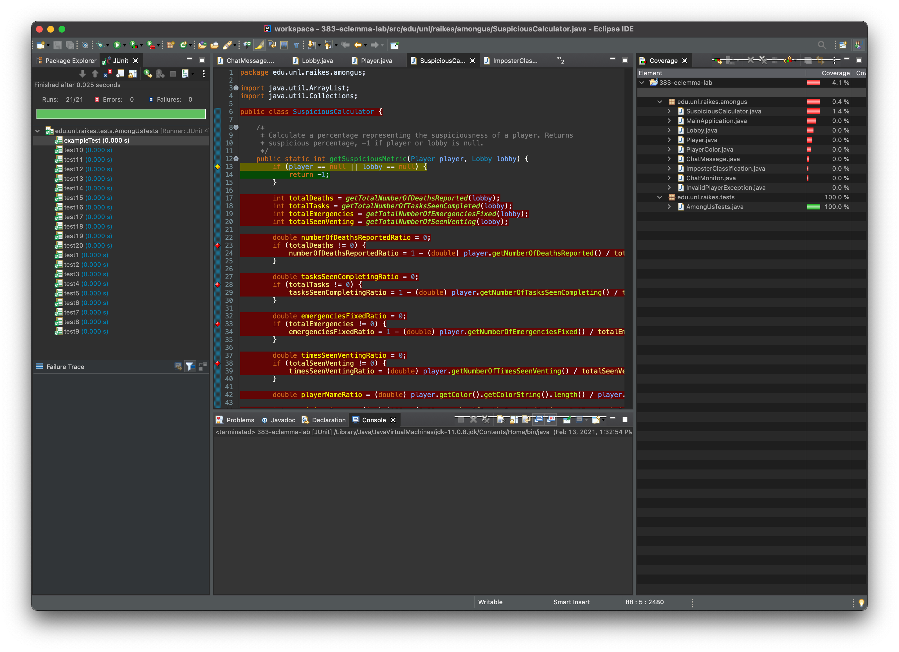

# raik-383-eclemma-lab
### Introduction

Students at the Raikes School have recently started work on prediction algorithms for the popular Among Us game. In order to begin work on these algorithms, they have replicated a portion of the game in Java and have added an additional class titled `SuspiciousCalculator` to house their different prediction functionality. One thing they have forgotten to do, however, is add unit tests for the game functionality and their prediction algorithms. As students enrolled in a software engineering course, you realize their mistake and set out to add unit tests. Rather than just writing arbitrary unit tests hoping to cover all aspects of the game, you want to use a metric to ensure you are covering as many lines of the program as possible.

### EclEmma

Code coverage is a metric that can provide you with information about the percent of your program that is being covered by unit tests. In this lab, you will be using a built-in extension of Eclipse called EclEmma to obtain this measurement. Once cloning and opening this project in eclipse, you can run EclEmma using the following steps:

1. Right click on the project

2. Click on `Coverage As -> JUnit Test`

   

3. A panel will then pop up showing the code coverage for the different packages and the classes in the project

4. Additionally, lines that have been covered will be highlighted in green and lines that have not been covered are highlighted in red

   

5. To remove these highlights, select `Remove All Sessions ` in the panel

   

### Challenge

Your challenge for this lab is to work with your team to obtain as much code coverage as possible in the `src.edu.unl.raikes.amongus` part of the codebase in just 20 unit tests. One method of collaboration could be a Google Doc where each member of your team writes tests and pastes them in the document.
Read the section below for more information on what constitutes a proper unit test!
You will compete against other teams to obtain the best code coverage!

### Unit Tests

We would like you to write unit tests that test very specific pieces of functionality and are concise. Every line of code in the test should do something important and contribute to the functionality being tested. This means that there should only be one assert statement per unit test. This is to ensure the uniformity of tests between teams. (Please do not consolidate multiple mini-tests into a boolean and test the value of that). All tests require an error message, making it clear what went wrong. “Was True, should have been False” is not valid.

### Deliverables

**Leaderboard:** For the first deliverable, once you feel like you have maximized the code coverage, take a screenshot of your code coverage and add the screenshot to [this Google Doc](https://docs.google.com/document/d/1yeSXUBekgRyrwFzWLNS9xvkz7n97-l3lDbMstK5P1PE/edit?usp=sharing) (see Google Doc for an example)

**Reflection paper:** As a group, write a 2-3 page double spaced reflection paper outlining your experience creating the unit tests. In the paper, please reflect on:

1. Why code coverage is a useful metric
2. What code coverage does not tell you about your unit tests
3. How you could have used code coverage on previous assignments (from 183H, 184H, or 283H) to create better unit tests
4. What your takeaways from this lab are
5. How you will apply what you learned from this lab to your project this semester

**Code:** Lastly, please submit your team's `AmongUsTests.java` file with your 20 completed unit tests

The reflection paper and code file can both be turned in on Canvas for this assignment.